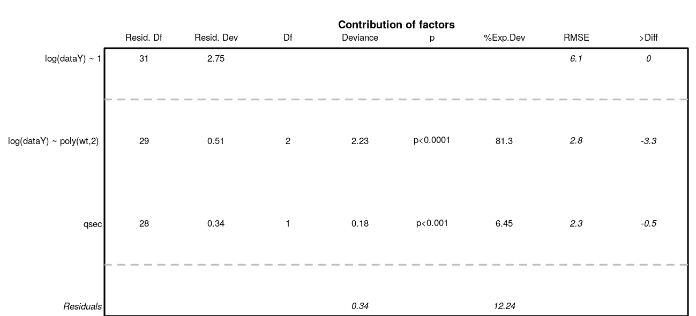

```{r setup, include=FALSE, purl=FALSE}
knitr::opts_chunk$set(
  echo = TRUE, 
  message = FALSE,
  warning = FALSE,
  fig.show = 'asis',
  out.width = '75%',
  fig.align = 'center',
  fig.width = 7,
  fig.height = 7
)
```

## Outlines
This library has been created for model selection to predict species distributions (Biomass, density or presence/absence). Its final aim is to produce maps of predicted distributions.  
In this vignette, we use datasets from library `dismo` to show the different possibilities of the library with species distribution modelling, from model selection to predictive mapping. Dataset `bradypus` contains geographic position of species occurence. The different model types available in library `ModelSelect` to predict probability of presence all rely on presence/absence data. As the dataset only contains presence data, we need to create a pseudo-absence set of observations. Here, we do not discuss this method. We just imagine that we have a dataset of real observations of presence and **real observations of absences**, so that we can use presence-absence models.  
We create a variable of interest (`Obs`) with presences (`1`) and absences (`0`). This is in accordance with our data modelling case `datatype = "PA"` and its sub-cases. For other types of data, refer to the documentation (in particular, options in `modelselect_opt`) to correctly set your modelling parameters.  
*Note that most figures of the vignette are saved in "inst" so that model selection is not run during vignette building. However, code in the vignettes can be run on your own computer and should return the same outputs. To do so, open and run this Rmd file: `r system.file("SDM_Selection", "SDM_Selection.Rmd", package = "SDMSelect")`.*

## Load libraries and other setup
```{r}
library(SDMSelect)
library(ggplot2)
require(dismo)

set.seed(50)
# Temp directory for saving all outputs
tmpdir <- paste0(tempdir(), "/out_SDM")
dir.create(tmpdir)
```

## Covariates
Covariates are environmental covariates that will be used to predict distribution of the species. In this vignette, we use raster already prepared from package `dismo`. This means that all rasters have the same projection, extent and resolution and can be stacked into a multi-layer Raster. In this case, they can directly be stacked together. If this is not your case, you can use function `Prepare_r_multi` to reproject, resample, crop all rasters of covariates to the dimensions of a reference raster (if needed). You only need to provide a vector of all paths to these rasters. Rasters representing factors / categories (like `biome.grd` here), should be resampled using nearest neighbour method (if they need to be resampled), thus they have to be declared with `is.factor` option.

```{r}
# World map for plots
data(wrld_simpl, package = "maptools")

# Vectors of paths to rasters of covariates
covariates.paths <- 
  list.files(file.path(system.file(package = "dismo"), 'ex'),
             pattern = 'grd$',
             full.names = TRUE)

# Here covariates <- stack(covariates.paths) 
# would have been enough for this specific case.
is.factor <- grep("biome.grd", covariates.paths)

covariates <- Prepare_covarStack(cov.paths = covariates.paths, 
                              is.factor = is.factor)

```
```{r}
print(covariates)
```


## Dataset
A presence-absence dataset is created from dataset `bradypus` in library `dismo`. Dataset is transformed as `SpatialPointsDataFrame` and spatially joint with covariates. Here, all covariates rasters have originally the same projection, extent and resolution. Covariates information can then directly be extracted from the covariates RasterStack with `raster::extract(covariates, data.sp)`. However, if your covariates Rasters have originally different projection, you should extract covariate information at your data positions from these original rasters. Indeed, reprojection of raster leads to modification and potential loss of the original information. It is recommended to reproject the point data stations to extract covariates from their projection of origin. Function `CovarExtract` does this task for you.

```{r}
# Presence data
file <- file.path(system.file(package = "dismo"), "ex/bradypus.csv")
bradypus <- read.table(file,  header = TRUE,  sep = ',')[,-1]
# Random-absence data
randAbs <- dismo::randomPoints(covariates, 400)
colnames(randAbs) <- c("lon", "lat")
# Combine presence and absence
data.sp <- rbind(data.frame(randAbs, Obs = 0),
                 data.frame(bradypus, Obs = 1)
              )
# Transform data as SpatialPointsDataFrame
sp::coordinates(data.sp) <- ~lon+lat
sp::proj4string(data.sp) <- "+proj=longlat +datum=WGS84"

# Extract covariates, combine with dataset and set factor covariate
data <- CovarExtract(x = data.sp, cov.paths = covariates.paths,
                     is.factor = is.factor)
  
```

```{r, results='asis', echo=FALSE, purl=FALSE}
knitr::kable(head(data@data))
```

```{r, out.width='50%'}
# Show observations positions
par(mar = c(1,1,1,1))
raster::plot(covariates, "bio1")
sp::plot(wrld_simpl, add = TRUE)
sp::plot(data, 
     col = c("red", "blue")[data@data$Obs + 1],
     pch = 20, cex = c(0.5, 1)[data@data$Obs + 1],
     add = TRUE)
```

## Prepare the spatial dataset for modelling
The first step only consists in changing observation column name to `dataY` and append factor column names with `factor_` for compatibility with following functions.
```{r}
data.prepared <- Prepare_dataset(
  x = data, var = 1, cov = 2:ncol(data),
  datatype = "PA", na.rm = TRUE
)
```
```{r, echo=FALSE, purl=FALSE}
data.prepared
```

The random-absence dataset was deliberately created with a lot of stations. A high number of observations may lead to spatial auto-correlation that may interfere with modelling. We can simplify the dataset by resampling in 
a regular grid with a resolution partially reducing spatial-autocorrelation.  
Function `spatialcor_dist` helps define an optimal grid resolution for this purpose. There may be different depth of spatial auto-correlation in the dataset. Function `spatialcor_dist` allows comparing two levels using two maximum distances `max1` and `max2`. Two correlograms are calculated on the dataset based on these maximum values. A linear threshold model is fitted to find a possible threshold in correlation. This threshold value can be used for resampling in a regular grid having this value as a resolution.

```{r}
thd <- spatialcor_dist(
  x = data.prepared, longlat = !is.projected(data),
  binomial = TRUE, saveWD = tmpdir,
  plot = TRUE,
  figname = "Correlogram"
)
```
```{r, out.width='90%', purl=FALSE, echo=FALSE, fig.caption='Find threshold in spatial auto-correlation of data'}
silent <- file.copy(file.path(tmpdir, "Correlogram.jpg"),
          "Correlogram.jpg")
knitr::include_graphics("Correlogram.jpg")
```

We choose a resolution for resampling the data using proposition of `spatialcor_dist` function. Here, thresholds estimated are `r paste(round(thd/1000), collapse = 'km and ')`km. The second value is used to build a regular grid, with which the spatial dataset is resampled. Function `RefRasterize` allows creating a grid with a defined resolution. Function `Prepare_dataset` is then re-run to create the new dataset passed through the grid. For all observations in the same grid cell, the function calculates the average spatial position, the average of all numeric covariates, the most frequent factor covariate, observation of presence if the species was present at least once in the cell (*the mean of observations when continuous data*). `data.new` output is a `SpatialPointsDataFrame`.

```{r, out.width='50%'}
# Create a regular grid from dataset
RefRaster <- RefRasterize(x = data, res = round(thd[2]))
# Use rectangular grid to resample dataset
data.new <- Prepare_dataset(
  x = data.prepared, var = 1, cov = 2:ncol(data),
  RefRaster = RefRaster, datatype = "PA", na.rm = TRUE
)

# Plot data.new
par(mar = c(1,1,1,1))
raster::plot(covariates, "bio1")
sp::plot(wrld_simpl, add = TRUE)
sp::plot(data.new, 
     col = c("red", "blue")[data.new@data$dataY + 1],
     pch = 20, cex = c(0.5, 1)[data@data$Obs + 1],
     add = TRUE)
```

## Covariates correlation
Due to identifiability issues, highly correlated environmental covariates should not be included in the same models. Correlations between all possible pairs of covariates are tested using the Spearman's rho coefficient. Here, a rho value exceeding 0.7 considers covariates too correlated to be included in the same model. However, the following cross-validation procedure also guarantees too correlated covariates not to be included in the same models as gain in prediction may be low. Thus, the present covariates correlation selection step mainly allows the number of tested models to be reduced.

```{r}
corSpearman <- Param_corr(
  x = data.new, rm = 1, thd = 0.7, visual = FALSE,
  plot = TRUE, img.size = 8, saveWD = tmpdir)

```
```{r, out.width='50%', purl=FALSE, echo=FALSE, fig.caption='Correlation between covariates'}
silent <- file.copy(file.path(tmpdir, "Covariate_correlation_crop.png"),
          "Covariate_correlation_crop.png")
knitr::include_graphics("Covariate_correlation_crop.png")
```

## Find the best combination of covariates
Set options for presence-absence models. Have a look at options documentation `?modelselect_opt`.
```{r}
modelselect_opt(RESET = TRUE)
modelselect_opt$Max_nb_Var <- 3
modelselect_opt$datatype <- "PA"
```

Procedure selects combination of covariates in each iteration from one covariate to the maximum defined (modelselect_opt("Max_nb_Var") = `r modelselect_opt("Max_nb_Var")`). 
This reproduces the procedure separately for all model types defined (modelselect_opt("modeltypes") = `r paste(modelselect_opt("modeltypes"), collapse = ", ")`).
The output of `findBestModel` function is the link to a zipped file of all outputs saved in the `saveWD` directory. Messages in the console shows the steps of the iterative model selection procedure.

```{r, eval=FALSE}
res.file <- findBestModel(x = data.new, datatype = "PA", 
                          corSpearman = corSpearman, 
                          saveWD = tmpdir, 
                          verbose = 1)
```

## Order models according to quality of prediction
Model selection was realised separately for each distribution tested. The exact same k-fold cross-validation datasets have been used to keep the best model at each step of the iteration procedure. All indices of goodness of fit can thus be compared among the distributions tested with paired statistical tests. This allows to order all models tested. The best model and the following ones not statistically worse than the best one (one-sided `p-value >= modelselect_opt$lim_pvalue_final`) are retained.

```{r, eval=FALSE}
# Order models and find the bests
BestModels <- ModelOrder(saveWD = tmpdir, plot = TRUE)
```
```{r, echo=FALSE}
BestModelsFile <- system.file("SDM_Selection", "BestModels.rds", package = "SDMSelect")
BestModels <- readr::read_rds(BestModelsFile)
```

This results in figures showing the distribution of the goodness of fit (here AUC) issued from cross-validation for each model. This allows to see that predictive power of some models is not very different than the best one. Coloured boxplots are those of AUC distribution not statistically different from the best one. Models are ranged by family chosen and number of covariates added during the forward stepwise procedure.  

```{r, results='asis', echo=FALSE, purl=FALSE, out.width='90%'}
Index_Error_on_crossVImg <- system.file("SDM_Selection", "Index_Error_on_crossV.png", package = "SDMSelect")
silent <- file.copy(Index_Error_on_crossVImg, "Index_Error_on_crossV.png")
knitr::include_graphics("Index_Error_on_crossV.png")
```

Two tables are available:

- "VeryBestModels_crossV" retains the best model and the ones not significantly worse than the first one.
```{r, results='asis', echo=FALSE, purl=FALSE}
knitr::kable(BestModels$VeryBestModels_crossV, row.names = FALSE)
```

- "BestForModeltypes" retains the first two best models of each "modeltype".
```{r, results='asis', echo=FALSE, purl=FALSE}
knitr::kable(BestModels$BestForModeltypes, row.names = FALSE)
```

Covariates selected in all models not statistically different from the best one may be explored to choose the best model by expertise. Covariates are ordered based on occurrence in the models selected. You may want to choose between the best model and the model with most selected covariates.

```{r, results='asis', echo=FALSE, purl=FALSE, out.width='90%'}
Help_for_model_ChoiceImg <- system.file("SDM_Selection", "Help_for_model_Choice.png", package = "SDMSelect")
silent <- file.copy(Help_for_model_ChoiceImg, "Help_for_model_Choice.png")
knitr::include_graphics("Help_for_model_Choice.png")
```

## Predictions of the best model
We can choose one model, the best one here, and create a set of figure outputs to explore what it is predicting. Figures are saved in `saveWD` and its compressed version (its path is the output of the function, here stored in `res.file`)
```{r, message=FALSE, results='hide', eval=FALSE}
Num.Best <- BestModels$VeryBestModels_crossV$Num[1]
res.file <- ModelResults(saveWD = tmpdir, plot = TRUE, 
                 Num = Num.Best)
```

In the case of a model with presence-absence, the outputs are the following.

- Analysis of variance. Deviance explained by each covariate when added sequentially in the order specified by the cross-validation procedure. "%Exp.Dev" stands for percentage of explained deviance. "AUC" is the mean AUC on the validation datasets as issued from the cross-validation procedure, ">Diff" being the difference of cross-validation AUC with the previous step.  
```{r, results='asis', echo=FALSE, purl=FALSE, out.width='100%'}
Param_Exp_DevianceImg <- system.file("SDM_Selection", "Param_Exp_Deviance.png", package = "SDMSelect")
silent <- file.copy(Param_Exp_DevianceImg, "Param_Exp_Deviance.png")

```

- Marginal predictions by covariates. These are simplified marginal effects of each covariate in the range of observations. All covariates values except one have been fixed so that their combination give a prediction close to the mean of observations. These simplified marginals figures are to be read for their relative effect and not for their absolute prediction.  
```{r, results='asis', echo=FALSE, purl=FALSE}
CovForMeanPred_MarginalsImg <- system.file("SDM_Selection", "CovForMeanPred_Marginals.png", package = "SDMSelect")
silent <- file.copy(CovForMeanPred_MarginalsImg, "CovForMeanPred_Marginals.png")
knitr::include_graphics("CovForMeanPred_Marginals.png")
```

- Comparison of predictions against observations and proposition of threshold values to separate presence from absences. The best threshold value is based on cross-validation outputs. This is the value closest to selectivity equals specificity.  
```{r, results='asis', echo=FALSE, purl=FALSE}
Thresholds_for_predictionImg <- system.file("SDM_Selection", "Thresholds_for_prediction.png", package = "SDMSelect")
silent <- file.copy(Thresholds_for_predictionImg, "Thresholds_for_prediction.png")
knitr::include_graphics("Thresholds_for_prediction.png")
```

## Species distribution mapping
### Probability of presence
The outputs of the best model can be used to predict species distribution. The model selected is coupled with the raster of `covariates` to predict a probability of presence in each cell of the raster. Function `Map_predict` returns a `RasterStack` with these predictions.   
```{r, eval=FALSE}
pred.r <- Map_predict(object = covariates, saveWD = tmpdir, Num = Num.Best)
```
```{r}
predr <- system.file("SDM_Selection", "predr.tif", package = "SDMSelect")
pred.r <- raster::stack(predr)
predrNames <- system.file("SDM_Selection", "predrNames.rds", package = "SDMSelect")
names(pred.r) <- readr::read_rds(predrNames)
```

The first output of interest is the first layer `resp.fit` of the `RasterStack`. Here, the predicted probability of presence. *`SDMSelect` is provided with `gplot_data`, a modified version of `rasterVis::gplot` which allows to prepare a (part of) raster data for ggplot visualisation instead of visualizing it directly. Maybe useful in some situations.*

```{r, out.width='60%', fig.height=6}
# Get partial raster data to plot in ggplot
pred.r.gg <- gplot_data(pred.r)
# Plot
ggplot() +
  geom_tile(
    data = dplyr::filter(pred.r.gg, variable == "resp.fit"), 
            aes(x = x, y = y, fill = value)) +
  scale_fill_gradient("Probability", low = 'yellow', high = 'blue') +
  coord_equal()

```


### Uncertainties
Function `Map_predict` also calculates different indices for the assessment of the uncertainty of prediction. For instance, minimum (quantile = 5%) and maximum (quantile = 95%) of possible predictions. (*This is based on quantiles predictions in the scale of the link function, then transformed in the scale of the response.*)  
```{r, out.width='90%', fig.width=9, fig.height=4.5}
rasterVis::gplot(raster::dropLayer(pred.r, which(!names(pred.r) %in% c("Q5", "Q95")))) +
  geom_tile(aes(fill = value)) +
  facet_grid(~variable) +
  scale_fill_gradient("Probability", low = 'yellow', high = 'blue') +
  coord_equal()
```

The inter-quartile range (`IQR`) and the `IQR` divided by the median (`IQR.M`) give an idea of the absolute and relative uncertainty of the predictions. This is similar to standard deviation and coefficient of variation respectively but better here because predictions are not Gaussian shaped.

```{r, out.width='60%', fig.height=6}
rasterVis::gplot(raster::dropLayer(pred.r, which(!names(pred.r) %in% c("IQR")))) +
  geom_tile(aes(fill = value)) +
  facet_grid(~variable) +
  scale_fill_gradient("Absolute\nDispersion", low = 'white', high = 'red') +
  coord_equal()
```
```{r, out.width='60%', fig.height=6}
rasterVis::gplot(raster::dropLayer(pred.r, which(!names(pred.r) %in% c("IQR.M")))) +
  geom_tile(aes(fill = value)) +
  facet_grid(~variable) +
  scale_fill_gradient("Relative\nDispersion\nto median", low = 'white', high = 'red') +
  coord_equal()
```

### Separating presence from absences
The best threshold value to separate presences from absences may not be `0.5` when the presence/absence data are not equilibrated among covariates selected. The best threshold value (`BestTHD`) is shown above in the plot comparing observations and predictions. We can retrieve this value with function `model_select`.
```{r, eval=FALSE}
model_selected <- model_select(
  saveWD = tmpdir,
  new.data = data.new,
  Num = Num.Best)
BestThd <- model_selected$Seuil
```
```{r}
BestThdFile <- system.file("SDM_Selection", "BestThd.rds", package = "SDMSelect")
BestThd <- readr::read_rds(BestThdFile)
```


A better representation of the probabilities of presence should be with a double colour gradient, centred on the best threshold value (thd = `r BestThd`).  
```{r, out.width='60%', fig.height=6}
rasterVis::gplot(raster::raster(pred.r, "resp.fit")) +
  geom_tile(aes(fill = value)) +
  scale_fill_gradient2("Probability\nof\nPresence",
                       low = 'white', mid = 'yellow',  high = 'blue',
                       midpoint = BestThd) +
  coord_equal()
```

Considering uncertainty of prediction, another output is the probability (%) to be over the best threshold value (thd = `r BestThd`). This gives an idea of the risk to predict a presence, considering the uncertainty on the probability of presence and the best threshold value.  
```{r, out.width='60%', fig.height=6}
rasterVis::gplot(raster::raster(pred.r, "ProbaSup")) +
  geom_tile(aes(fill = value)) +
  scale_fill_gradient2("Probability\nto be over\nThreshold", 
                      low = 'white', mid = 'yellow', high = 'forestgreen',
                      midpoint = 50) +
  coord_equal()
```

### Masks
Finally, a model should not extrapolate out of the range of the data. The `Map_predict` function retrieves the range of covariates in the dataset used for modelling and create a raster mask for each covariate when out of the range of data observations. In the present example mask is not meaningful because of the absence data covering the entire area.  
```{r, out.width='90%', fig.width=9, fig.height=4.5}
rasterVis::gplot(raster::dropLayer(pred.r, which(!grepl("mask", names(pred.r))))) +
  geom_tile(aes(fill = factor(value))) +
  facet_grid(~variable) +
  scale_fill_manual("mask", values = c("0" = "red", "1" = "forestgreen")) +
  coord_equal()
```

